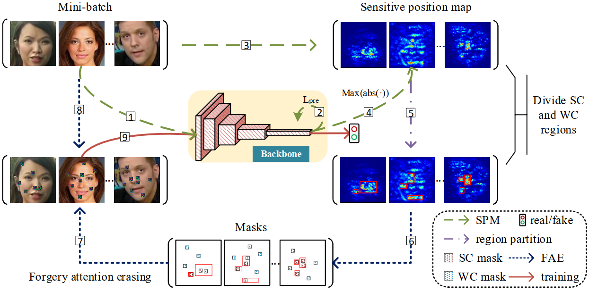

# A Data Augmentation Framework by Mining Structured Features for Fake Face Image Detection

Zhiqing Guo<sup>1</sup>, 
Gaobo Yang<sup>1</sup>,
Dewang Wang<sup>1</sup>,
and Dengyong Zhang<sup>2</sup></br>
<sup>1</sup> Hunan University, China; 
<sup>2</sup> Changsha University of Science and Technology, China</br>



## MSF
For fake face image detection, most existing detectors exploit local artifacts, ignoring the mining of structured forgery clues existed in global images, which greatly constrains detection performance. In this work, we verify the importance of structured forgery clues for face image forgery detection, and present a new data augmentation framework called Mining Structured Features (MSF) to promote the convolutional neural network (CNN) based detector. Specifically, MSF generates a position-sensitive artifact map, which is exploited to divide a candidate face image into strong correlation (SC) and weak correlation (WC) regions. By dynamically erasing some positions in SC and WC regions during the training process, MSF can promote the robustness of the detector to the above regions. In essence, MSF expands the attention range of the detector and fully mines the structured features from global images. MSF plays an auxiliary role, which can be seamlessly integrated into existing CNN-based detectors for end-to-end training. Extensive experimental results on four public datasets including HFFD, FF++, DFDC and Celeb-DF show that the detectors trained with the guidance of MSF can mine more useful clues distributed in fake face images to improve detection accuracies, achieving better results than state-of-the-art works.

## Requirements
- PyTorch 1.7.1
- Python 3.6.8

## Usage of MSF
The MSF needs to be embedded in the training pipeline of the detection network to augment the training data.
- Input: (detection model, in_tensor)
- Output: out_tensor

## Citation
Please cite our paper if the code is used in your research:
```
@article{GUO2023103587,
title = {A data augmentation framework by mining structured features for fake face image detection},
journal = {Computer Vision and Image Understanding},
volume = {226},
pages = {103587},
year = {2023},
issn = {1077-3142},
doi = {https://doi.org/10.1016/j.cviu.2022.103587},
url = {https://www.sciencedirect.com/science/article/pii/S1077314222001655},
author = {Zhiqing Guo and Gaobo Yang and Dewang Wang and Dengyong Zhang},
```
